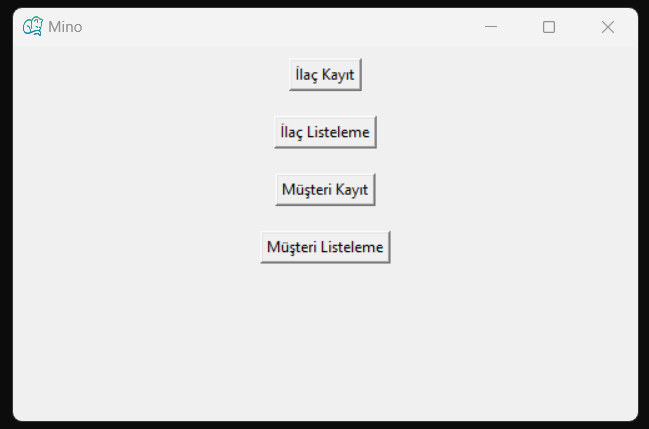
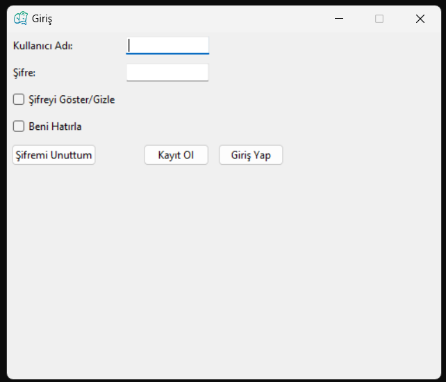
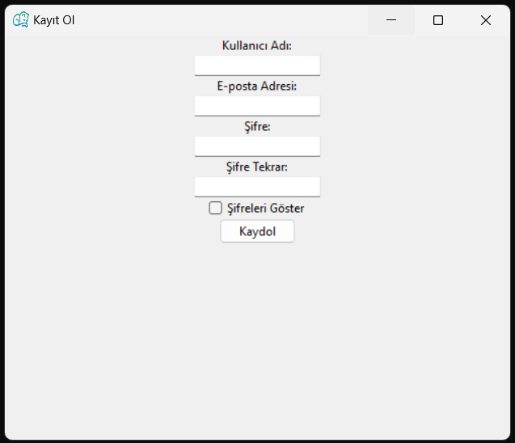
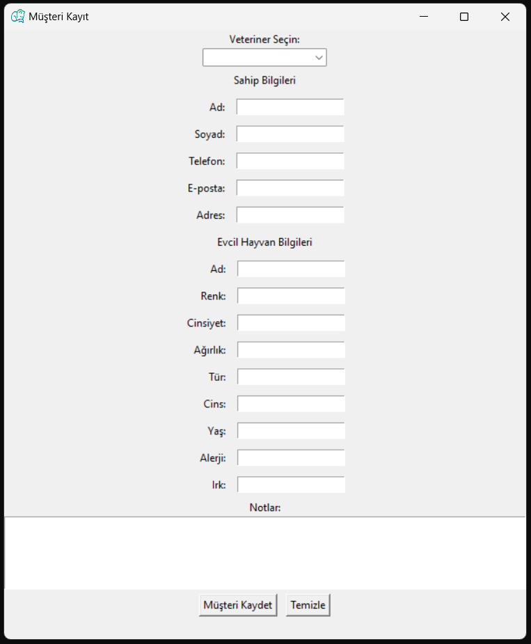
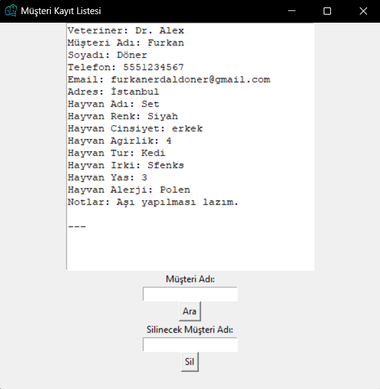
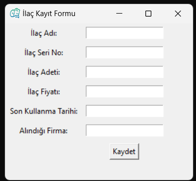
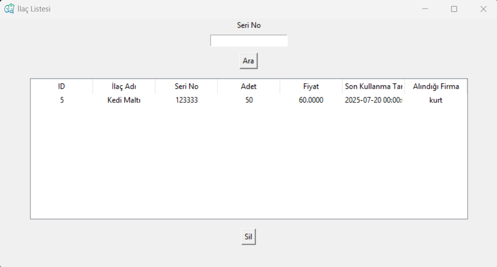

\# MİNO - Veteriner Otomasyon Sistemi


Bu proje üniversite bitirme projesi olarak geliştirilmiştir.


\## Proje Hakkında

MİNO, veteriner klinikleri için geliştirilmiş basit bir otomasyon sistemidir.


\## Özellikler

\- Müşteri kayıt işlemleri

\- Hayvan bilgileri

\- İlaç kayıtları

\- Python + Microsoft Access veritabanı


\## Kullanılan Teknolojiler

\- Python

\- Microsoft Access (.accdb)


## Ekran Görüntüleri










\## Çalıştırma

```bash

python Mino.py


Kullanıcı Adı: Furkan

Şifre: 123456

Not: Veritabanlarındaki veriler örnek/dummy verilerden oluşmaktadır.

